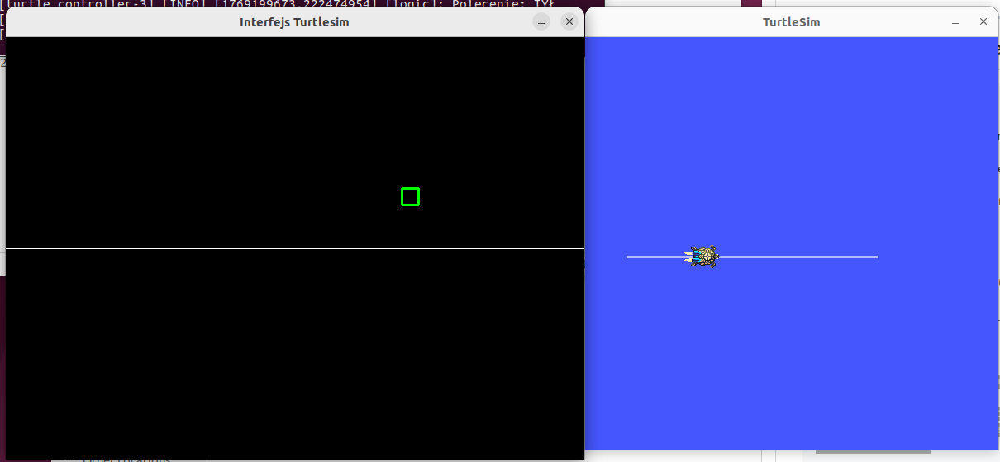

# Projekt NiOdSR – Sterowanie w ROS2

## 📝 Opis projektu
Projekt został zrealizowany w ramach przedmiotu **NiOdSR** (Narzędzia i Oprogramowanie do Sterowania Robotów) i wykonany w środowisku **ROS2**.

Celem projektu było stworzenie własnego **węzła (node’a) ROS2**, który umożliwia sterowanie robotem **TurtleSim** poprzez interakcję użytkownika. Projekt demonstruje podstawowe mechanizmy ROS2, takie jak:
- tworzenie node’ów,
- publikacja wiadomości (Topics),
- komunikacja pomiędzy komponentami systemu.

---

## 🚀 Funkcjonalność
Projekt oferuje następujące możliwości:
- Uruchomienie symulatora **TurtleSim**.
- Sterowanie ruchem robota.
- Obsługa zdarzeń użytkownika (np. sterowanie za pomocą interfejsu/myszy).
- Możliwość uruchomienia projektu lokalnie lub w izolowanym kontenerze **Docker**.

---

## 🛠️ Technologie
* **ROS2** (Humble Hawksbill)
* **Python 3**
* **TurtleSim**
* **Docker**
* **Linux** (Ubuntu)

---

## 📋 Wymagania
Aby uruchomić projekt lokalnie, potrzebujesz:
- Zainstalowanego środowiska **ROS2** (np. Humble) na systemie Linux.
- **Python 3**.
- Narzędzia budowania `colcon`.
- Serwera **X11** (do obsługi GUI symulatora).

Do uruchomienia w kontenerze wymagany jest jedynie **Docker**.

---

## ⚙️ Instalacja i uruchomienie (Lokalnie)

*Wymaga uprzedniej instalacji ROS2 Humble na urządzeniu.*

1. Przejdź do katalogu źródłowego swojego workspace'a i sklonuj repozytorium:
    ```bash
    cd ~/ros2_ws/src
    git clone https://github.com/michuuu123514/NiOdSR.git

    ```

2. Zbuduj pakiet:
    ```bash
    cd ~/ros2_ws
    colcon build --packages-select camera_control
    ```

3. Załaduj środowisko i uruchom launch file:
    ```bash
    source install/setup.bash
    ros2 launch camera_control turtle_launch.py
    ```

---

## 🐳 Instalacja i uruchomienie (Docker)

Jeśli nie chcesz instalować ROS2 lokalnie, możesz skorzystać z Dockera.

1. Przejdź do katalogu z plikiem `Dockerfile` (wewnątrz pobranego repozytorium):
    ```bash
    cd ~/ros2_ws/src/camera_control
    ```

2. Zbuduj obraz Dockera:
    ```bash
    sudo docker build -t camera_control_obraz:latest .
    ```

3. Uruchom kontener z przekierowaniem GUI (X11):
    ```bash
    xhost +local:root
    
    sudo docker run --rm -it --net=host \
      -e DISPLAY=$DISPLAY \
      -v /tmp/.X11-unix:/tmp/.X11-unix:rw \
      camera_control_obraz:latest
      
    xhost -local:root
    ```

---

## 📷 Podgląd działania

